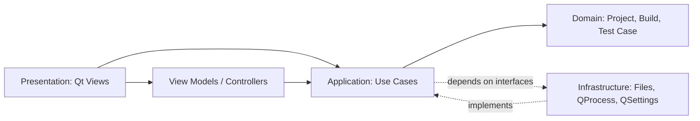

# OfflineCode Studio

> A lightweight, fully offline desktop IDE for modern C++ development.

[](https://isocpp.org/)
[](https://www.qt.io/)
[](https://cmake.org/)
[](https://github.com/offlinecode-studio/offlinecode-studio/actions/workflows/ci.yml)
[](LICENSE)

OfflineCode Studio brings editing, project management, compilation, execution, and competitive-programming workflows into one fast desktop application. It does not require an account, cloud service, telemetry endpoint, or network connection.

> [!NOTE]
> This repository is a production-oriented architecture and documentation baseline. The UI shell and core contracts are included; the feature roadmap tracks work toward the sample `v1.0` release.

## Why OfflineCode Studio?

- **Private by design:** source code and settings remain on the local machine.
- **Focused:** no browser runtime, online account, or heavyweight extension host.
- **Beginner-friendly:** compiler diagnostics are surfaced beside the relevant source.
- **Competition-ready:** test-case execution, time limits, and output comparison are first-class workflows.
- **Portfolio-grade:** layered architecture, dependency inversion, automated tests, CI, and contributor documentation are built into the project plan.

## Planned Feature Set

| Area | Capabilities |
|---|---|
| Editor | C++ syntax highlighting, line numbers, brace matching, code folding, search/replace, multiple tabs, auto-indent |
| Projects | Create/open/import projects, source tree, recent projects, per-project build settings |
| Build | Compiler discovery, configurable flags, streamed diagnostics, debug/release profiles, cancellation |
| Run | Integrated input/output console, timeout handling, exit codes, working-directory controls |
| Competitive programming | Multiple test cases, expected-output diff, execution time, pass/fail summary, templates |
| Productivity | Keyboard shortcuts, session restore, autosave recovery, light/dark themes |
| Platform | Windows, Linux, and macOS with GCC, Clang, or MSVC adapters |

## Interface Preview

```text
+--------------------------------------------------------------------------------+
| File  Edit  View  Build  Run  Tools  Help       [Debug v] [Build] [Run]       |
+----------------------+---------------------------------------------------------+
| PROJECT              | main.cpp                                               |
| v two-sum             +---------------------------------------------------------+
|   > src               | #include <iostream>                                   |
|     main.cpp          |                                                       |
|   > tests             | int main() {                                          |
|   offlinecode.json    |     std::cout << "Hello, OfflineCode!\n";            |
|                       |     return 0;                                         |
|                       | }                                                     |
|                       |                                                       |
+----------------------+---------------------------------------------------------+
| PROBLEMS (1) | BUILD | RUN | TEST CASES                                       |
| main.cpp:5: warning: unused variable 'answer'                                 |
+--------------------------------------------------------------------------------+
| Ready | C++17 | clang++ | Ln 6, Col 1 | UTF-8                                 |
+--------------------------------------------------------------------------------+
```

Detailed flows and responsive behavior are in [UI Wireframes](docs/UI_WIREFRAMES.md).

## Architecture

OfflineCode Studio follows MVC at the presentation boundary and a layered dependency rule throughout the codebase.



- **Presentation:** widgets render state and forward user intent; they do not invoke compilers or parse project files.
- **Application:** use-case services coordinate project, build, run, and test workflows.
- **Domain:** framework-independent entities and value objects enforce invariants.
- **Infrastructure:** Qt and STL adapters implement filesystem, process, persistence, and toolchain interfaces.

See the [Software Design Document](docs/SDD.md) and [architecture guide](docs/ARCHITECTURE.md).

## Repository Layout

```text
OfflineCode-Studio/
|-- .github/                  # CI workflows and community templates
|-- cmake/                    # Dependency discovery and packaging helpers
|-- docs/                     # Requirements, design, testing, releases, roadmap
|-- examples/                 # Importable sample projects
|-- resources/                # Icons, themes, templates, translations
|-- src/
|   |-- app/                  # Composition root
|   |-- domain/               # Pure business types
|   |-- application/          # Use cases and ports
|   |-- infrastructure/       # OS, filesystem, compiler adapters
|   `-- presentation/         # Qt views and controllers
|-- tests/
|   |-- unit/
|   `-- integration/
|-- CMakeLists.txt
`-- README.md
```

## Build From Source

### Prerequisites

- A C++17 compiler: GCC 11+, Clang 14+, Apple Clang 14+, or MSVC 2022
- CMake 3.24+
- Qt 6.5+ (`Core`, `Gui`, `Widgets`, `Test`)
- QScintilla 2.14+ built for Qt 6
- Ninja (recommended)

### Configure and build

```bash
git clone https://github.com/offlinecode-studio/offlinecode-studio.git
cd offlinecode-studio
cmake -S . -B build -G Ninja -DCMAKE_BUILD_TYPE=Debug
cmake --build build
ctest --test-dir build --output-on-failure
```

Set `CMAKE_PREFIX_PATH` when Qt or QScintilla is installed outside the default search path. Platform-specific setup belongs in [BUILDING.md](docs/BUILDING.md).

## Project Manifest

Each project contains an `offlinecode.json` file:

```json
{
  "schemaVersion": 1,
  "name": "two-sum",
  "standard": "c++17",
  "sources": ["src/main.cpp"],
  "build": {
    "compiler": "auto",
    "flags": ["-Wall", "-Wextra", "-pedantic"]
  },
  "run": { "workingDirectory": ".", "timeoutMs": 3000 }
}
```

JSON was chosen over a database because project state is small, hierarchical, portable, diffable, and edited as a unit. See [Database Decision](docs/DATABASE_DECISION.md).

## Documentation

The [deliverable index](DELIVERABLE_INDEX.md) maps the complete project brief to repository artifacts.

| Document | Purpose |
|---|---|
| [SRS](docs/SRS.md) | Functional and non-functional requirements with acceptance criteria |
| [SDD](docs/SDD.md) | Components, class diagrams, data design, and runtime behavior |
| [Architecture](docs/ARCHITECTURE.md) | Module boundaries, SOLID decisions, patterns, folder structure |
| [Repository Structure](docs/REPOSITORY_STRUCTURE.md) | Public repository layout and module ownership rules |
| [Feature Plan](docs/FEATURE_PLAN.md) | Detailed implementation sequence and definition of done |
| [Testing](docs/TESTING.md) | Test strategy, cases, environments, and quality gates |
| [Roadmap](docs/ROADMAP.md) | Milestones from alpha through post-1.0 |
| [Known Issues](docs/KNOWN_ISSUES.md) | Current limitations, severity, workarounds, and proposed fixes |
| [Release Notes](docs/RELEASE_NOTES.md) | Sample `v0.1`, `v0.5`, and `v1.0` release notes |
| [Career Showcase](docs/SHOWCASE.md) | Resume bullets, LinkedIn post, portfolio copy, and interview pitch |

## Contributing

Issues labeled [`good first issue`](docs/FIRST_TIME_CONTRIBUTOR_ISSUES.md) are scoped for a first contribution. Read [CONTRIBUTING.md](CONTRIBUTING.md), create a focused branch, add tests, and open a pull request using the provided template.

```bash
git checkout -b feat/descriptive-name
cmake --build build
ctest --test-dir build --output-on-failure
```

## Security and Privacy

OfflineCode Studio never uploads source code. Compiled programs are untrusted local processes; the application enforces timeouts but is **not a security sandbox**. Do not run unknown code outside an isolated operating-system environment. Report vulnerabilities privately as described in [SECURITY.md](SECURITY.md).

## Roadmap Snapshot

- `v0.1 Alpha`: editor shell, project manifest, save/open, single-file build and run
- `v0.5 Beta`: diagnostics, project tree, test-case runner, themes, session recovery
- `v1.0 Stable`: cross-platform installers, accessibility pass, hardened recovery, stable manifest schema

The complete milestone plan is in [ROADMAP.md](docs/ROADMAP.md).

## License

Distributed under the MIT License. See [LICENSE](LICENSE).

---

Built for students, competitors, and developers who want their tools fast, local, and understandable.
