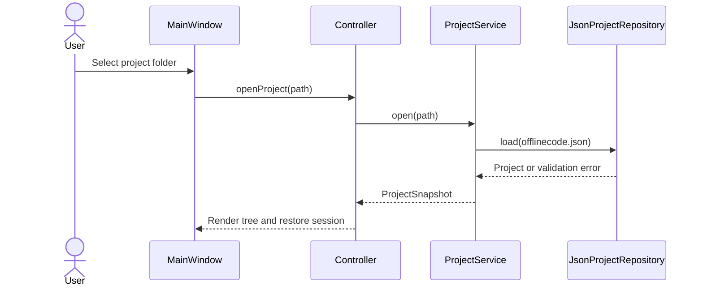

# Architecture Guide

## 1. Architectural Drivers

OfflineCode Studio optimizes for offline operation, fast startup, low idle memory, testability, cross-platform behavior, and a codebase that can grow without coupling UI widgets to operating-system details.

## 2. Architectural Style

The application uses layered architecture with MVC in the presentation layer.

| Layer | Owns | Must not own |
|---|---|---|
| Presentation | Qt widgets, controllers, view state, shortcuts | File parsing, compiler command construction, domain rules |
| Application | Use cases, orchestration, interfaces/ports | Widget types, platform APIs |
| Domain | Entities, value objects, invariants | Qt, filesystem, process execution |
| Infrastructure | Filesystem, JSON, `QProcess`, `QSettings`, compiler adapters | Product policy or UI decisions |

Dependencies point inward. Infrastructure is connected at the composition root in `src/app/main.cpp`.

## 3. Module Map

```text
src/
|-- app/
|   `-- main.cpp                      # Process entry and dependency composition
|-- domain/
|   |-- entities/
|   |   |-- project.h                 # Project aggregate
|   |   |-- source_document.h         # Open document and dirty state
|   |   `-- test_case.h               # Input, expected output, limits
|   `-- value_objects/
|       |-- build_profile.h            # Compiler, standard, flags
|       `-- diagnostic.h               # Severity and source location
|-- application/
|   |-- interfaces/
|   |   |-- compiler_service.h         # Build port
|   |   |-- file_system.h              # Filesystem port
|   |   |-- process_runner.h            # Program execution port
|   |   `-- project_repository.h       # Manifest persistence port
|   `-- services/
|       |-- build_coordinator.*         # Build lifecycle use case
|       |-- project_service.*           # Open/create/save project use cases
|       `-- test_runner.*               # Multi-case execution use case
|-- infrastructure/
|   |-- compiler/                       # GCC, Clang, MSVC command/diagnostic adapters
|   |-- filesystem/                     # std::filesystem and atomic-write adapters
|   |-- persistence/                    # JSON manifest and QSettings adapters
|   `-- process/                        # QProcess runner, timeout, cancellation
`-- presentation/
    |-- main_window/                    # Main view and controller
    |-- editor/                         # QScintilla editor widgets/models
    |-- project_explorer/               # Project tree
    |-- output/                         # Build/run/test panes
    `-- dialogs/                        # Settings, project, toolchain dialogs
```

Headers are colocated with implementation files inside the owning module. Public interfaces are narrow; no umbrella header exposes all layers.

## 4. SOLID Application

- **Single Responsibility:** `ProjectRepository` reads/writes manifests; `BuildCoordinator` manages build state; compiler adapters translate tool-specific behavior.
- **Open/Closed:** a new toolchain implements `ICompilerService` without changing controllers.
- **Liskov Substitution:** all compiler adapters return the same normalized `BuildResult` contract.
- **Interface Segregation:** build, process, filesystem, and settings ports are separate.
- **Dependency Inversion:** application services accept interfaces through constructors; `main.cpp` supplies Qt/STL implementations.

## 5. Patterns

| Pattern | Use | Reason |
|---|---|---|
| MVC | Main window, explorer, output panes | Keeps widgets passive and workflows testable |
| Command | Build, run, save, format actions | Centralizes enablement, shortcuts, and invocation |
| Strategy | GCC/Clang/MSVC command and diagnostic handling | Toolchains vary without changing use cases |
| Observer | Qt signals/slots for state and output events | Decoupled asynchronous UI updates |
| Repository | Project manifest persistence | Hides JSON and atomic-write mechanics |
| Factory | Toolchain discovery and adapter creation | Selects a compatible compiler at runtime |
| State | Build lifecycle (`Idle`, `Building`, `Cancelling`) | Prevents overlapping or invalid actions |

A service locator and global mutable singleton are deliberately avoided. `QApplication` is framework-owned; application services remain explicitly constructed.

## 6. Key Runtime Flows

### Open project



### Build and run

1. Controller requests `BuildCoordinator::build(profile)`.
2. Coordinator validates saved inputs and transitions to `Building`.
3. Compiler strategy produces an argument list, never a shell command string.
4. `QProcess` starts the compiler with a controlled working directory.
5. Output is streamed, parsed into normalized diagnostics, and emitted to the controller.
6. On success, Run invokes the output binary through `IProcessRunner`.
7. Cancellation and timeouts terminate, wait briefly, then kill if necessary.

## 7. Threading and Responsiveness

- GUI objects remain on the main thread.
- `QProcess` is asynchronous; output is consumed via signals.
- Directory scanning and large-file analysis run through a bounded worker pool.
- Controllers receive immutable snapshots or value objects across threads.
- A generation ID prevents stale asynchronous results from replacing current state.

## 8. Error Handling

Expected failures use `Result<T, Error>`-style values at application boundaries. Exceptions are reserved for programmer errors or converted at infrastructure boundaries. Errors have a stable code, user-facing summary, technical detail, and optional recovery action. Logs exclude source contents and standard input by default.

## 9. Security Boundaries

- Process arguments are passed as lists to `QProcess`; no shell interpolation is used.
- Project paths are canonicalized and validated before filesystem operations.
- Manifest-relative paths may not escape the project root without explicit user choice.
- Writes use a temporary sibling plus atomic rename where supported.
- Running compiled code is not sandboxed. This limitation must remain visible in the UI and documentation.

## 10. Performance Budgets

| Metric | Target on reference laptop |
|---|---|
| Cold startup to usable editor | <= 1.5 seconds (P95) |
| Idle resident memory | <= 150 MB |
| Keypress-to-paint latency | <= 16 ms (P95) for files under 10k lines |
| Open 5 MB source file | <= 2 seconds |
| Cancel build feedback | <= 250 ms |

Reference hardware and measurement methods are defined in `TESTING.md`.

## 11. Evolution Rules

1. Domain code may use only C++17 STL headers.
2. Application code may depend on domain and application interfaces.
3. Infrastructure and presentation may depend on Qt.
4. Presentation may not instantiate infrastructure adapters.
5. Every new external integration starts behind a narrow interface and contract test.
6. Manifest schema changes require migration tests and a version increment.
