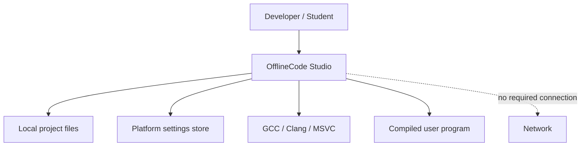
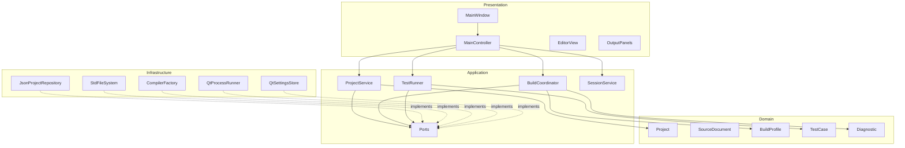
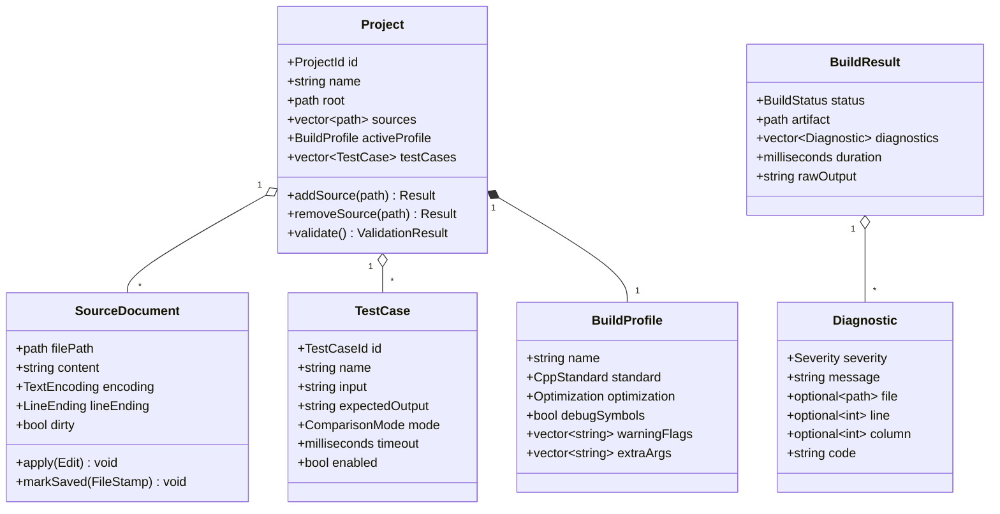
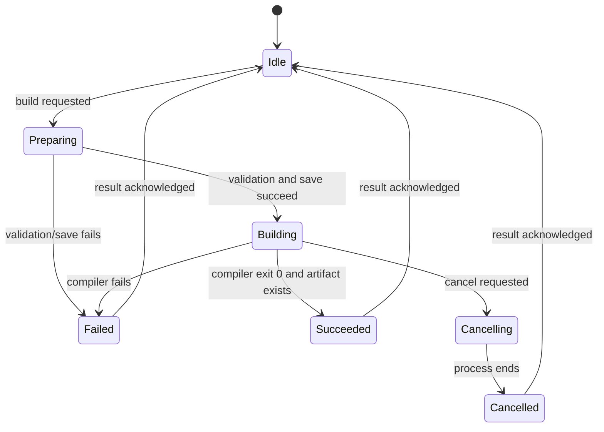

# Software Design Document

**Product:** OfflineCode Studio
**Design baseline:** C++17, Qt 6, QScintilla, CMake

## 1. Design Goals

The design isolates policy from Qt widgets and operating-system integration, keeps the startup path short, uses asynchronous processes, makes file writes recoverable, and allows toolchains to evolve independently.

## 2. System Context



The application owns no cloud service. Compiler and child-program behavior is external and treated as fallible.

## 3. Component Design



## 4. Domain Class Diagram



Domain identifiers are opaque value types rather than indexes. Durations use `std::chrono`; paths use `std::filesystem::path`; UI text conversion occurs at boundaries.

## 5. Application Interfaces

```cpp
class IProjectRepository {
public:
    virtual ~IProjectRepository() = default;
    virtual Result<Project, ProjectError> load(const std::filesystem::path&) = 0;
    virtual Result<void, ProjectError> save(const Project&) = 0;
};

class ICompilerService {
public:
    virtual ~ICompilerService() = default;
    virtual ToolchainInfo info() const = 0;
    virtual BuildHandle build(const BuildRequest&, BuildObserver&) = 0;
};

class IProcessRunner {
public:
    virtual ~IProcessRunner() = default;
    virtual RunHandle start(const RunRequest&, RunObserver&) = 0;
};
```

Production interfaces use project-owned result and observer types. The excerpts define intended ownership: returned handles are movable cancellation/lifetime controls; observers outlive active handles and receive callbacks on the documented executor.

## 6. Controllers and Views

`MainController` owns the current application snapshot and commands. It exposes action state (`canBuild`, `canRun`, `canStop`) so views do not duplicate policy. Presentation models convert domain paths, diagnostics, and test results into Qt roles. Views emit user intent and render state; dialogs return validated DTOs.

QScintilla is wrapped behind `CodeEditor`, limiting lexer and marker details to the editor module. The application layer never depends on `QsciScintilla`.

## 7. Build State Machine



Only one build is active per project in v1. A monotonically increasing operation ID causes late process signals from an old operation to be ignored.

## 8. Compiler Strategy

`CompilerFactory` probes configured and PATH candidates with bounded `--version`/equivalent calls. Each strategy provides:

- version parsing and capability detection;
- compile/link argument construction as a string list;
- output artifact naming;
- diagnostic parsing with raw-line fallback;
- platform environment adjustments.

Build directories are profile- and toolchain-specific to prevent artifact confusion. A deterministic build request includes sources, root, output path, standard, flags, and environment delta.

## 9. Execution and Test Runner

`QtProcessRunner` wraps asynchronous `QProcess`. It writes stdin, closes the write channel, drains both output channels, enforces a monotonic deadline, and caps retained output while continuing to drain the process. Timeout termination is:

1. Mark result `TimedOut` and request graceful termination.
2. Wait a short configurable grace period without blocking the GUI.
3. Kill the process tree where platform APIs permit.
4. Emit exactly one terminal result.

`TestRunner` queues enabled cases with concurrency 1 by default for deterministic behavior and fair timing. It normalizes output only according to the selected comparison mode and records the first mismatch location.

## 10. Persistence Design

### 10.1 Project manifest

```json
{
  "schemaVersion": 1,
  "name": "sample",
  "sources": ["src/main.cpp"],
  "activeProfile": "debug",
  "profiles": {
    "debug": {
      "standard": "c++17",
      "optimization": "none",
      "debugSymbols": true,
      "warnings": ["all", "extra"],
      "extraArgs": []
    }
  },
  "run": {
    "arguments": [],
    "workingDirectory": ".",
    "timeoutMs": 3000,
    "outputLimitBytes": 1048576
  }
}
```

Parsing has three phases: syntax parse, schema/type validation, then semantic/domain validation. Error paths identify fields such as `/profiles/debug/standard`. Save is deterministic, formatted, and atomic.

### 10.2 Machine-local state

`QSettings` keys are namespaced by feature and version, for example `editor/tabWidth` and `session/v1/openDocuments`. Secrets are not stored. Corrupt values fall back individually rather than discarding all settings.

## 11. File Safety

`StdFileSystem` performs canonical or weakly-canonical comparisons with platform-aware case handling. Before replacing an existing file, `SourceDocument` compares its stored size/mtime stamp and, where needed, a content hash. Autosaves are written outside source paths and cleaned after confirmed save or discard.

## 12. Diagnostics

Compiler output remains available verbatim. Parsed diagnostics are best-effort additions, not replacements. Parsers accept fixture lines and reject absurd line/column values. Unknown lines stay in the Build panel. Clicking a diagnostic opens canonical project-contained paths; external paths require explicit user confirmation.

## 13. Logging and Observability

The local rotating log records version, platform, feature events, durations, error codes, and stack/context metadata where available. It excludes document contents, stdin/stdout, full environment variables, and usernames when paths can be relativized. Logging defaults to Info and can be disabled.

## 14. Packaging

- Windows: CMake/CPack ZIP and installer; deploy Qt with `windeployqt`.
- macOS: `.app` bundle and signed/notarized DMG; deploy Qt with `macdeployqt`.
- Linux: AppImage or distro package; test bundled/system QScintilla licensing and ABI.

Build metadata is generated by CMake. CI artifacts are unsigned test packages; protected release workflows use environment-scoped signing credentials.

## 15. Design Verification

Architecture tests/lint rules prevent Qt includes in `src/domain` and presentation imports in application code. Unit tests use fake ports. Contract tests run every compiler strategy against common fixtures. Integration tests cover temporary directories and real child processes. GUI tests cover action enablement and critical workflows, while manual release tests cover accessibility, display scaling, and platform packaging.
